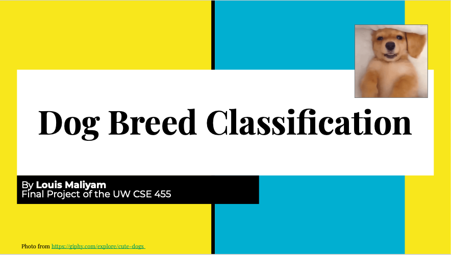
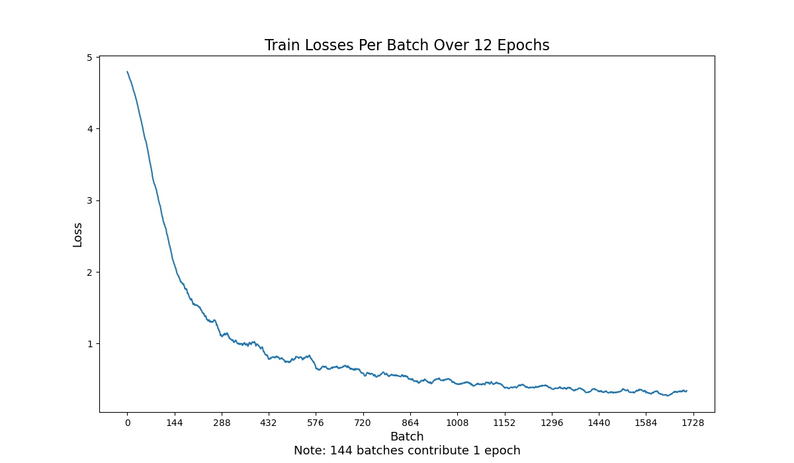
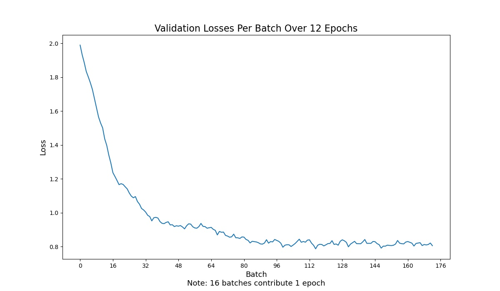
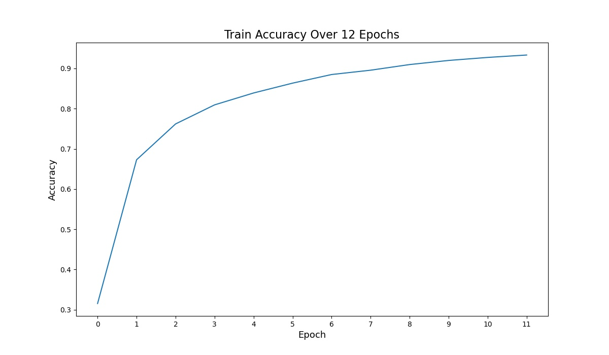
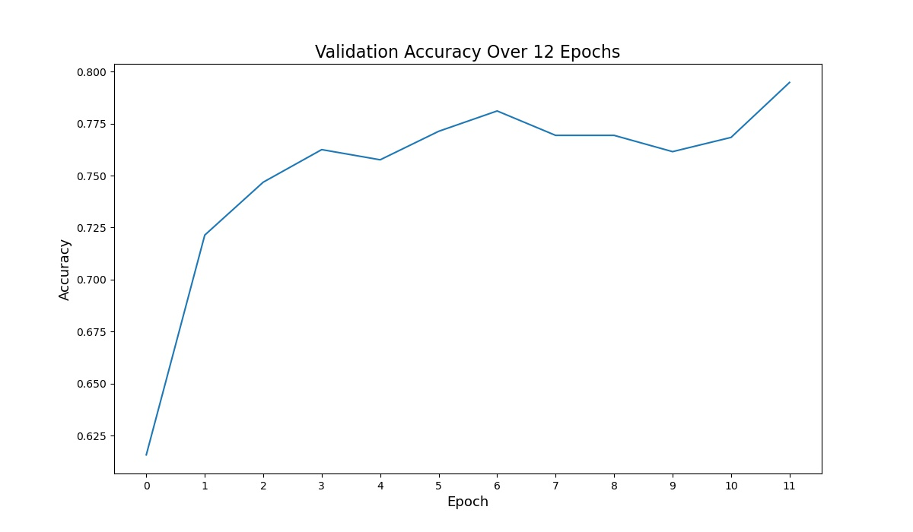

# Dog-Breed-Classification

View running application on **Heroku App**: https://dog-breed-classifier-maliyp.herokuapp.com/

I have trained a CNN model using a pretrained model [resnext50_32x4d](https://pytorch.org/hub/pytorch_vision_resnext/) to classify dog breeds. I focus on 120 breeds of dogs which is listed [here](data/classes.txt). The training dataset contains 10,222 images of dogs, in which I randomly sample 10% (which is 1,023) of the images to be in validation dataset. This makes the model learn from 9,199 of the dog images.

Applying image augmentations and using a the trained model described above for 12 epochs give us 93.34% accuracy on the training dataset and 79.47% accuracy on the validation dataset.

Click an image below to see the **video** about this project:
[](https://youtu.be/gLeTgqN6ojs)

## How to train the model?

Run
```
python main.py --train
```
To change hyperparameters, see option list of things you can pass into the training program by running
```
python main.py --help
```
To see an example of how I trained the model, feel free to refer to this [Colab notebook](https://colab.research.google.com/drive/1hLzUMpJpho_-E_zT1pagCJ-urzeGTHld?usp=sharing).

## Introduction

Dogs are CUTE! And they have so many breeds that just by looking at the picture, we (humans) may not know what breed they are. That's why I wanted to come up with an application that can predict dog breed from an uploaded image of users.

## Dataset

To approach the dog breed classification problem, I used a [Dog Breed Identification Dataset](https://www.kaggle.com/c/dog-breed-identification/overview) from Kaggle which was made for prediction competition. The dataset provided the mapping from picture id to the dog breed (i.e. class). So, I organized training images such that dog images are contained inside its own dog breed folder, so it's easy for PyTorch to load in the dataset (see [data/train](data/train) folder for more details).

The dataset contains 10,222 images of dogs to train. To be able to evaluate the model, I randomly sampled 10% of them which is 1,023 of the images to use for validation dataset.

## Data Augmentation

To make the model more generalized, I randomly perform image augmentations to the training images before inputting them into the model, so the model see a more diverse data. Specifically, I performed random crop and random horizontal flip on the image (see [train.py](src/train.py#L25) for more details).

## Network Architecture

I used [resnext50_32x4d](https://pytorch.org/hub/pytorch_vision_resnext/) and its pretained weight, so the network that I used here has similar architecture as `resnext50_32x4d`. However, I changed the last fully connected layer such that it has output size of 120, which matches the number of classes (i.e. dog breeds) that our dataset contains.

The training image was transformed into size of 128x128 before inputting into the model. Each image is in RGB, so they all start with three channels. I want to classify the images into one of the 120 classes, so, as I mentioned earlier, I ended up with a fully connected layer that has 120 nodes at the end.

I used cross entrophy as a loss function. I also used stochastic gradient descent as a way to optimize my training model. Moreover, I used scheduler with `step_size` and `gamma` to decay the learning rate while training the model. More details can be found in [train.py](src/train.py). Specifically, for the final model, for optimizer, I chose `learning rate=0.001`, `momentum=0.9`, and `weight_decay=0.0005`. For scheduler, I chose `gamma=0.7` and `step_size=3`. You could see how I trained my model in this [Colab notebook](https://colab.research.google.com/drive/1hLzUMpJpho_-E_zT1pagCJ-urzeGTHld?usp=sharing).

## Results

After running models on several hyperparameters, I ended up with the final model that yields 93.34% accuracy on the training dataset and 79.47% accuracy on the validation dataset. Below are the charts from training the model:






## Discussion

We could see that the model is doing pretty well with the training dataset. In facts, some of my training model even got to 99.50% accuracy for the training dataset. However, it's doing a bit worse on the validation set. Therefore, we could safely assume that this model is still overfitting the training dataset. In the future, we could try adding more dropout layers or tune around weight_decay parameter to make the model more generalized, in order to not overfit the training dataset.

Also, this model can only predict 120 dog breeds. In order to make it cover more breeds of dogs, we may need to come up with bigger dataset and bigger model to train.

## Author

This project is created by Louis Maliyam for the final project of the University of Washington CSE455 (Spring 2021). Special thanks to Joseph Redmon, as the infrastructure of the code were retrieved from his [Colab notebook](https://colab.research.google.com/drive/1kHo8VT-onDxbtS3FM77VImG35h_K_Lav#scrollTo=yRzPDiVzsyGz).